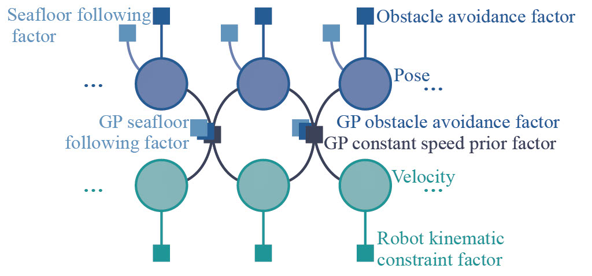

# MGPMP
**Mission-oriented Gaussian Process Motion Planning (MGPMP) is a novel motion planning framework for unmanned under-water vehicles (UUVs) - the first framework
that applies Gaussian process motion planning to solve a 3D path planning problem for a 6-DoF robot in underwaterenvironments. We address missions requiring UUVs to remain
in close proximity to seafloor terrain, which must be achieved alongside collision avoidance. Our framework also considers the influence of current flows as part of the cost function, allowing for more accurate planning.**
<p align="center"></p>

## 
 - Here we provide a 3D motion planning example and two example datasets, NYC upper bay dataset and Queen Elizabeth Island dataset.
 - **The GP Motion Planning code in GPMP2 doc is developed based on [GPMP2](https://github.com/borglab/gpmp2.git).**
```
  ├──MGPMP
     ├── ...
     ├── gpmp2                      # GP Motion Planning code
     ├── tests
     │   └── Mobile3DPlanning.cpp   # 3D motion planning example
     ├── data                       # Folder for NYC upper bay(NYC) and Queen Elizabeth Island upper bay(str) dataset
     └── ...
  ```
# Dependencies
- [CMake](http://www.cmake.org/cmake/resources/software.html) >= 3.0 
```bash
sudo apt-get install cmake
```
- [Boost](http://www.boost.org/users/download/) >=1.65 < 1.74
```bash
sudo apt-get install libboost-all-dev
```

- [GTSAM](https://github.com/borglab/gtsam.git) 4.0.0 
```bash
git clone https://github.com/borglab/gtsam.git
cd gtsam
git checkout wrap-export # only work with specific version of GTSAM
mkdir build && cd build
cmake ..
make check  # optional, run unit tests
sudo make install
```

- [ YAML-cpp](https://github.com/jbeder/yaml-cpp.git) 
```bash
git clone https://github.com/jbeder/yaml-cpp.git
cd 
mkdir build && cd build
cmake ..
make
sudo make install
```

- [edt](https://github.com/seung-lab/euclidean-distance-transform-3d)
```bash
git clone https://github.com/seung-lab/euclidean-distance-transform-3d.git
mkdir UUVPlanning/third_party/edt
cp euclidean-distance-transform-3d/cpp/edt.hpp UUVPlanning/third_party/edt
cp euclidean-distance-transform-3d/cpp/threadpool.h UUVPlanning/third_party/edt

In file threadpool.h
change line 73 to:
inline void ThreadPool::start(size_t threads) {

In file edt.hpp
change line 144 to:
inline void squared_edt_1d_parabolic(
change line 225 to:
inline void squared_edt_1d_parabolic(
change line 295 to:
inline void _squared_edt_1d_parabolic(

```

- [matlot++](https://github.com/alandefreitas/matplotplusplus)
```bash
cd UUVPlanning/third_party
git clone https://github.com/alandefreitas/matplotplusplus.git
```
## How to use

```
cd Misson-Oriented-GP-Motion-Planning
mkdir build
cd build
cmake ..
make
tests/testMobile3D your_choice_of_yaml_file.yaml (example:../data/STR.yaml)
```


